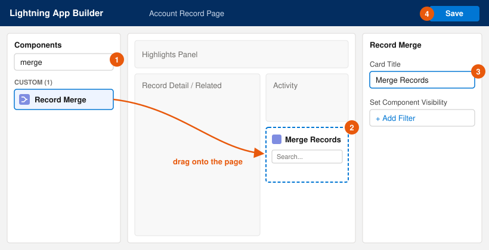
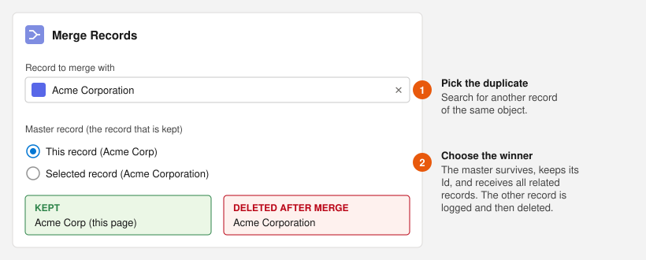
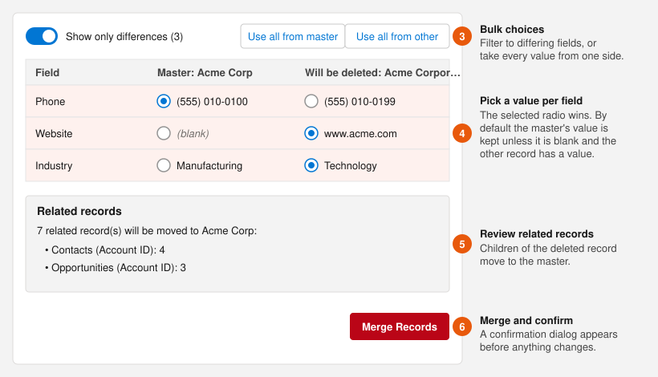

# Salesforce Record Merge

A simple, easy-to-use merge tool that can go on any record page. The user simply:
 - Chooses a record to merge with
 - Chooses the surviving record
 - Determines which values are going on the record

Done.

When the merge runs, the chosen field values are written to the surviving record, every related (child) record of the other record is moved to the survivor, a **Record Merge Log** is written with a full copy of the deleted record, and the other record is deleted.

## Installation

Deploy the metadata to your org with the Salesforce CLI:

```bash
sf org login web --alias my-org
sf project deploy start --manifest manifest/recordMerge.xml --target-org my-org
```

Then give users access by assigning the **Record Merge User** permission set:

```bash
sf org assign permset --name Record_Merge_User --target-org my-org
```

The permission set grants access to the `RecordMergeController` Apex class and read access to Record Merge Logs. Users also need edit and delete access on the object being merged, plus field-level edit access to any field whose value they copy. Related records are moved in system mode, like the standard Salesforce merge, so children the user can't see aren't orphaned or deleted.

## Adding the component to a record page

The **Record Merge** component works on any object that has a Lightning record page (Account, Contact, custom objects, and so on).



1. Open a record of the object you want to merge, click the **gear icon**, and choose **Edit Page**. This opens the Lightning App Builder.
2. In the **Components** panel, search for **merge**. Drag **Record Merge** (under *Custom*) onto the page. A sidebar column or its own tab works well.
3. *(Optional)* In the properties panel, change **Card Title** (default: *Merge Records*). You can also use **Set Component Visibility** to show the component only to certain profiles or permissions.
4. Click **Save**. If this is the first time the page has been customized, click **Activate** and assign it as the org default, app default, or app/record type/profile default.

## Merging records

### Step 1 – Choose the duplicate and the record that wins



1. In **Record to merge with**, search for the duplicate. Only records of the same object are shown, and the current record is excluded.
2. Under **Master record (the record that is kept)**, choose the winner:
   - **This record** – the record whose page you are on survives.
   - **Selected record** – the record you picked in the search survives.

The master record keeps its Id, so existing links and references to it continue to work. The other record is logged and then deleted. If the page you are on belongs to the record that gets deleted, you are taken to the surviving record after the merge.

> **Tip:** Keep the record that is older, more complete, or referenced by integrations as the master. You can still take individual field values from the other record in the next step.

### Step 2 – Choose which values to keep



3. **Bulk choices** – **Show only differences** (on by default) hides fields where both records already match; the count shows how many fields differ. **Use all from master** or **Use all from other** selects every value from one side at once.
4. **Pick a value per field** – In each row, select the radio button next to the value you want on the surviving record. Rows highlighted in color have different values. By default the master's value is selected, **unless the master's value is blank and the other record has one**. In that case the other value is pre-selected so no data is lost. Changing the master record in Step 1 resets these defaults.
5. **Review related records** – The **Related records** box lists every child record (contacts, opportunities, cases, files, custom children, and so on) that will move from the deleted record to the master.
6. **Merge Records** – Click the button and confirm the dialog. Nothing changes until you confirm.

Only fields you can edit are shown in the comparison.

## Merge history

Every merge creates a **Record Merge Log** record (available from the *Record Merge Logs* tab), which stores:

| Field | Contents |
| --- | --- |
| Object API Name | The object that was merged |
| Surviving Record Id | The master record |
| Abandoned Record Id / Name | The record that was deleted |
| Abandoned Record JSON | A full copy of the deleted record's field values |
| Field Selections JSON | Which values were taken from the deleted record |
| Reparented Records JSON | The Ids of child records that were moved, by relationship |

Use the log to audit merges or to rebuild a record that was merged by mistake.

## Project structure

- `force-app/main/default/lwc/recordMerge` – the Lightning web component
- `force-app/main/default/classes/RecordMergeController.cls` – Apex entry point for the component
- `force-app/main/default/classes/RecordMergeService.cls` – comparison, re-parenting and merge logic
- `force-app/main/default/objects/Record_Merge_Log__c` – merge history object
- `force-app/main/default/permissionsets/Record_Merge_User` – permission set for users
- `manifest/recordMerge.xml` – deployment manifest
